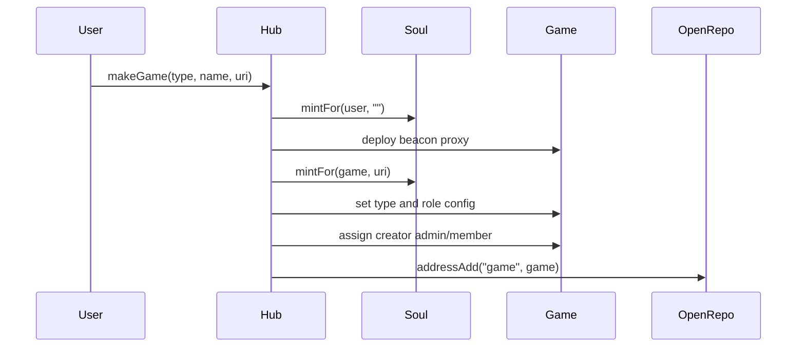
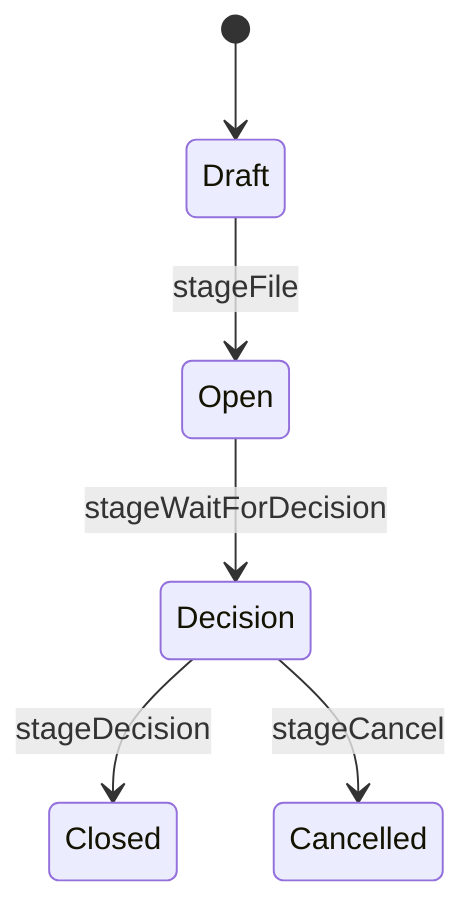

# Protocol Concepts

SoulSystem Protocol models social coordination as identity, context, roles, rules, procedures, and effects.

## Core Concepts

### Soul

`SoulUpgradable` is the identity layer.

- one primary soulbound token per account;
- secondary account mappings for a token;
- handles and metadata;
- non-transferability for normal account transfers;
- opinion or reputation-like scores about tokens.

### Hub

`HubUpgradable` is the protocol registry and factory.

- stores the shared repository address;
- registers associations such as `SBT`, `RULE_REPO`, `VOTES_REPO`, and `action`;
- deploys games, claims, and tasks through beacon proxies;
- manages implementation beacons;
- migrates known children to a replacement hub.

### Game

`GameUpgradable` is a social context.

- initializes `admin`, `member`, and `authority` roles;
- lets accounts join and leave membership;
- stores game type and config in the repository;
- reads rules and executes effects;
- routes extension calls by game type.

### Procedure

Claims and tasks are procedure contracts inside a game.

- `ClaimUpgradable` handles claim filing, decision, verdict, and rule-effect execution.
- `TaskUpgradable` handles task opening, applications, applicant acceptance, delivery approval, cancellation, refunds, and disbursement.

### Repositories

Repositories are protocol-owned data services.

- `OpenRepoUpgradable`: generic owner-scoped storage.
- `RuleRepo`: rules, conditions, confirmations, and effects.
- `ActionRepoTrackerUp`: semantic action definitions.
- `VotesRepoTrackerUp`: voting units and delegation for soul tokens.

### Extensions

Extensions add optional behavior to games without changing `GameUpgradable`.

Game types resolve extensions through repository keys such as `GAME_MDAO` and `GAME_PROJECT`.

## Association Flow

```mermaid
flowchart LR
  "Hub" -->|"getRepoAddr()"| "OpenRepo"
  "Hub" -->|"assocSet('SBT')"| "Soul"
  "Hub" -->|"assocSet('RULE_REPO')"| "RuleRepo"
  "Hub" -->|"assocSet('action')"| "ActionRepo"
  "Hub" -->|"assocSet('VOTES_REPO')"| "VotesRepo"
  "Game" -->|"dataRepo via Hub"| "OpenRepo"
  "Claim/Task" -->|"parent context"| "Game"
```

## Creation Flow



## Claim Happy Path



## Rule Effect Flow

```mermaid
flowchart LR
  "Authority" -->|"reportEvent(ruleId, account, uri)"| "Game"
  "Game" -->|"effectsGet(ruleId)"| "RuleRepo"
  "Game" -->|"opinionAboutToken(...)"| "Soul"
  "Soul" -->|"stores score"| "Opinion Checkpoints"
```

## Test References

- Deployment and associations: `test/integration/ProtocolDeployment.ts`
- Soul identity: `test/unit/Soul.ts`
- Hub factory behavior: `test/unit/Hub.ts`
- Game roles: `test/unit/GameRoles.ts`
- Claim lifecycle: `test/integration/ClaimLifecycle.ts` and `test/integration/ClaimHappyPath.ts`
- Task lifecycle and escrow: `test/integration/TaskLifecycle.ts` and `test/integration/TaskEscrow.ts`
- Rules and effects: `test/integration/RuleEffects.ts` and `test/integration/RuleManagement.ts`
- Extensions: `test/integration/Extensions.ts`
- Upgradeability: `test/upgradeability/*.ts`
